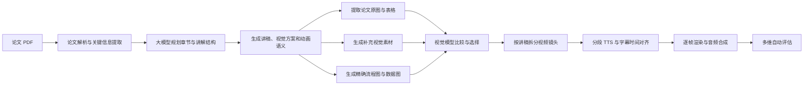

# 论文到场景化讲解视频系统

## 1. 

当前系统可以概括为：

> 论文输入 -> 内容理解 -> 故事板生成 -> 视觉素材选择 -> 场景与动画规划 -> TTS 与时间对齐 -> 视频渲染 -> 自动评估

---

## 2. 当前系统流程

### 2.1 论文解析

系统读取论文 PDF，并提取以下信息：

- 论文标题与作者；
- 研究背景和核心问题；
- 数据集、方法、系统模块和技术流程；
- 实验指标、结果、结论和局限；
- 论文中的架构图、流程图、表格和结果图。

这些信息共同构成后续故事板、讲稿和视觉生成的事实依据。

### 2.2 章节与叙事规划

章节数量由大模型根据论文长度、信息密度和内容结构决定，不再固定为五页或十页。

当前 Demo 由模型规划为八个章节：

1. 学术视频人工制作成本；
2. 长文本与多模态对齐挑战；
3. Paper2Video Benchmark；
4. 四类评价指标；
5. PaperTalker 多智能体框架；
6. Tree-of-Thought 内容生成方法；
7. Cursor Grounding 与字幕同步；
8. 定量实验结果。

整体叙事结构为：

> 研究问题 -> 技术挑战 -> 数据基础 -> 评价方法 -> 系统方案 -> 关键机制 -> 对齐能力 -> 实验结果

### 2.3 模型生成结构化故事板

每个章节由大模型生成完整的结构化内容，包括：

- 章节标题；
- 本章节的讲解目的；
- 核心论点；
- 自然语言口播讲稿；
- 视觉素材提示；
- 视觉类型；
- 流程节点或数据表；
- 动画标签；
- 场景布局、入场方式和强调重点。

当前所有面向观众显示的标题、标签、表格内容和讲稿均要求来自模型或论文事实，不使用本地默认占位文本。

系统会拒绝以下内容：

- `Point 1`、`Point 2` 等模板标签；
- 重复的表格列和角色说明；
- `TODO`、`Placeholder` 等占位内容；
- 空泛、重复或无法对应论文事实的讲稿；
- 不完整的视觉方案和场景方向。

### 2.4 内容准确性控制

故事板进入渲染前会经过完整性和事实一致性检查。

主要规则包括：

- 每个章节必须包含完整标题、讲解目标、论点、讲稿和视觉方案；
- 每页包含 2 至 6 个有效论点；
- 动画标签必须简洁、不同且具有具体含义；
- 表格数据不能整列重复；
- 关键数字必须在讲稿中原样保留；
- 讲稿不能引入论文中没有出现的结果或模块。

例如，`101`、`85.4%`、`0.92` 和 `6x` 等关键数据会被精确保留，避免模型进行近似改写。

---

## 3. 视觉生成与选择

系统目前使用三类视觉来源。

### 3.1 论文原始图表

系统从 PDF 中检测并提取完整的图、表和视觉区域，再通过视觉模型判断：

- 是否来自论文；
- 是否与当前讲解内容相关；
- 是否裁切完整；
- 是否适合视频分辨率；
- 图中文字是否能够阅读。

论文原图主要用于架构、方法和实验依据等需要高度准确性的内容。

### 3.2 模型生成视觉素材

对于研究动机、抽象概念和缺少合适原图的章节，系统调用图片模型生成场景化素材。

图片提示不仅包含当前章节标题，还包含整篇论文的背景、核心贡献、当前章节在叙事中的作用以及需要表现的实体和因果关系。因此，生成目标是解释具体研究内容，而不是使用通用的科技装饰图。

### 3.3 程序化视觉

对于需要精确表达的内容，系统通过代码绘制：

- 数据卡片和指标墙；
- 串行与并行流程；
- 多智能体节点；
- 证据表格；
- Cursor Grounding 示意；
- Tree-of-Thought 路径；
- 柱状图和数值动画。

这种方式能够避免生成图片中的乱码，并保证数字、模块名称和流程关系准确。

### 3.4 自动视觉选择

系统不会固定使用论文原图或生成图，而是由视觉模型比较候选素材的：

- 内容相关性；
- 学术准确性；
- 视频可读性；
- 图像完整性；
- 视觉质量；
- 与当前口播的匹配程度。

最终可以选择生成图、论文原图、程序化图表，或者在不同镜头中组合使用。

---

## 4. 视频化场景与动画

当前系统不会将每个章节作为一张静态页面持续播放，而是按照讲稿的语义变化拆分为多个镜头。

当前支持的镜头类型包括：

- 标题镜头；
- 场景建立镜头；
- 图片细节镜头；
- 完整流程镜头；
- 流程追踪镜头；
- 证据全景与局部特写；
- 数据全景、数据聚焦和结果镜头；
- 对比镜头；
- 章节总结镜头。

当前 Demo 的八个章节被拆分为 33 个独立镜头。

### 4.1 语义动画

动画由讲稿内容触发，而不是随机套用模板。当前动画事件包括：

- 节点依次出现；
- 信息沿流程移动；
- 并行任务同时推进；
- 柱状图逐步增长；
- 数字从零增长到最终值；
- 图片局部聚焦；
- 证据行逐项强调；
- 最终结果锁定。

当前 Demo 包含约 60 个语义动画事件。

### 4.2 动画稳定性

当前动画遵循以下原则：

- 使用平滑缓动，避免突然跳动；
- 每次动画结束后保留稳定阅读时间；
- 字幕和语音尚未完成时不切换镜头；
- 内部流程已有动画时，只使用轻微的整体入场；
- 不重复叠加多个强烈转场；
- 标题、字幕和关键数字保持稳定可读。

---

## 5. 语音、字幕与时间同步

系统将讲稿拆分成自然句子，并对每句话单独进行 TTS 合成。

具体过程为：

1. 生成分段讲稿；
2. 对每段文本调用 TTS；
3. 读取每段音频的真实时长；
4. 为句子加入开场准备、句间停顿和讲完后的阅读停留；
5. 按实际语音长度重新计算字幕和镜头时间；
6. 对齐鼠标、视觉焦点和动画；
7. 合并完整音频；
8. 将音频合入最终 MP4。

当前语速倍率为正常速度 `1.00`。

系统会强制检查：

- TTS 是否成功；
- 视频和音频时长是否一致；
- MP4 是否包含真实音频流；
- 镜头是否覆盖完整语音；
- 字幕是否与当前画面内容对应。

TTS 缓存采用“字幕序号 + 文本哈希”机制。修改一句讲稿时只重新生成该句音频，未变化的语音可以继续复用。

---

## 6. 自动评估系统

系统参考 DirectorBench 的 checkpoint-level diagnosis 思路，构建了面向论文讲解视频的评价器。

评价器从六个维度评分：

1. 内容与讲稿质量；
2. 视觉质量；
3. 音频与口播质量；
4. 跨模态对齐；
5. 稳定性与整体体验；
6. 修改建议的可执行性。

每个维度输出：

- 0 至 10 分；
- 置信度；
- 具体证据；
- 问题定位；
- 下一轮修改建议。

评价器读取的内容包括：

- 原论文摘要和关键信息；
- 故事板与讲稿；
- 字幕和时间戳；
- 场景时间线；
- 最终选中的视觉素材；
- 视频和音频元数据；
- 视觉策略和镜头分布。

评分时以最终选中的视觉资产和最终镜头为准，不会把生成过程中被拒绝的候选图误认为成片内容。

后续还可以接入用户标注的高分和低分案例，逐步学习用户偏好的信息密度、动画强度、语速、布局和评分权重。

---

## 7. 当前 Demo 结果

当前实验论文为：

> Paper2Video: Automatic Video Generation from Scientific Papers

最新 Demo 指标如下：

| 项目 | 当前结果 |
|---|---:|
| 章节数量 | 8 |
| 场景镜头数量 | 33 |
| 讲解与字幕段落 | 39 |
| 视频时长 | 约 428 秒 |
| 视频帧率 | 24 fps |
| 视频分辨率 | 1280 × 720 |
| 生成图通过数量 | 15 |
| 提取论文视觉区域 | 24 |
| 视频编码 | H.264 |
| 音频编码 | AAC |
| 音频合成 | 成功 |
| 自动评分 | 8.6 / 10 |
| 评价分类 | Excellent |
| 评分置信度 | 0.85 |
| 自动测试 | 114 项通过 |

当前成片：

`/tmp/auto_video_runs/paper2video_full_20260811_195746/video.mp4`

评分报告：

`/tmp/auto_video_runs/paper2video_full_20260811_195746/directorbench_prompt_eval_report.json`

关键帧检查图：

`/tmp/auto_video_runs/paper2video_full_20260811_195746/final_qa/contact.jpg`

---

## 8. 当前技术架构

### 8.1 生成和控制层

- 大语言模型：论文理解、章节规划、讲稿和视觉方案生成；
- 视觉模型：论文图识别、相关性判断、图像质量比较和视觉定位；
- 图片模型：生成场景化补充素材；
- TTS 模型：生成分段口播音频；
- Python Pipeline：流程控制、质量门、时间线、缓存和自动评估。

### 8.2 渲染层

- Python + Pillow：逐帧绘制场景、图表、文字和动画；
- ffmpeg：视频编码、音频合成和格式兼容；
- 输出规格：1280 × 720、24 fps、H.264 + AAC。

### 8.3 增量运行

系统具有以下 checkpoint：

- `scene_planned`：故事板和场景已经确定；
- `assets_ready`：视觉素材已经生成并选择；
- `timeline_ready`：字幕和场景时间线已经确定；
- `audio_ready`：TTS 已完成并对齐。

修改讲稿、评分器或渲染方式时，可以复用未变化的故事板、图片和音频，不必重新调用所有模型。

---

## 9. 当前状态与主要限制

当前系统已经能够生成具有多镜头、语义动画、论文图表、生成素材、字幕和音频的完整学术讲解视频。

但当前渲染本质仍是二维场景化动画：

- 图片、图表和文字主要处于同一平面；
- 镜头推进主要由二维缩放和局部裁切实现；
- 流程节点虽然会移动，但空间纵深有限；
- 缺少真实的三维摄像机、空间对象和立体转场。

因此，当前版本可以定义为：

> 场景化 2D 学术讲解视频系统

当前尚未完成真正的 3D 渲染。

---

## 10. 下一阶段：3D + Slide 混合表达

下一阶段计划加入 3D 空间表现，同时保留 2D Slide 图层的信息准确性。

建议比例为：

> 约 30% 3D 空间演示 + 70% 清晰的 2D 学术信息层

具体分工：

- 3D 用于展示空间关系、系统模块、数据流、并行机制和场景转场；
- 2D 用于展示标题、论文原图、表格、公式和精确数字；
- 字幕作为稳定的前景 HUD，不参与透视变形；
- 数据和结论继续通过代码绘制，保证数值准确。

优先考虑的 3D 场景包括：

1. 论文页面和图表从空间中分层展开；
2. 文本、图片、语音、字幕和人物通道在空间中汇合；
3. Paper 与 Video 配对对象形成 101 组数据集合；
4. PaperTalker 多智能体模块按数据流依次激活；
5. 串行轨道和并行轨道进行空间化对比；
6. 摄像机进入论文图，Cursor 锁定具体区域；
7. 精确指标以悬浮数据面板呈现。

第一步将先实现可切换的 `hybrid_3d` 渲染模式，并使用短片段验证空间感、可读性、画面稳定性和开发成本。验证有效后，再考虑使用 Three.js 与 Remotion 构建真正的三维渲染器。

---

## 11. 当前结论

目前系统已经形成完整、可运行、可评估和可增量迭代的论文讲解视频生成流程。

其核心能力包括：

- 根据论文内容自动规划章节；
- 生成来源明确的讲稿和视觉结构；
- 在论文原图、生成图和程序化图表之间自动选择；
- 将章节拆分为讲稿驱动的多镜头视频；
- 根据真实 TTS 时长同步字幕、动画和镜头；
- 自动检查内容、数字、音频和视觉资产；
- 使用多维 evaluator 对最终结果进行诊断。

当前重点不再是继续增加二维页面模板，而是将现有的内容、资产和时间线能力升级为 3D 与 Slide 结合的空间叙事，从而进一步减少“动态 PPT”的观感，提升视频表达能力。
